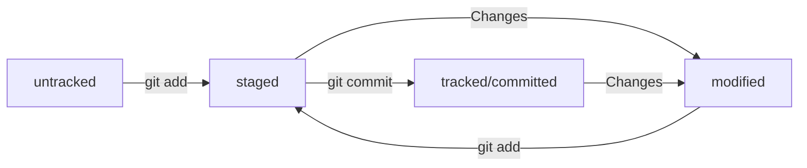

# Шпаргалка по работе с Git

---

## Оглавление
1. [Основные команды в консоли](https://github.com/angelinabakeeva/git-helper/blob/master/README.md#навигация)
2. [Основные команды по маркдауну](https://github.com/angelinabakeeva/git-helper/blob/master/README.md#основные-команды-по-маркдауну)
3. [Создание удалённого репозитория](https://github.com/angelinabakeeva/git-helper/blob/master/README.md#создание-удалённого-репозитория)
4. [Связка локального и удалённого репозиториев](https://github.com/angelinabakeeva/git-helper/blob/master/README.md#связка-локального-и-удалённого-репозиториев)
5. [Синхронизация локального и удалённого репозиториев](https://github.com/angelinabakeeva/git-helper/blob/master/README.md#синхронизация-локального-и-удалённого-репозиториев)
6. [Хеширование и логи](https://github.com/angelinabakeeva/git-helper/blob/master/README.md#хеширование-и-логи)
7. [Статусы файлов в Git](https://github.com/angelinabakeeva/git-helper/blob/master/README.md#статусы-файлов-в-git)
8. [Типичный жизненный цикл файла в Git](https://github.com/angelinabakeeva/git-helper/blob/master/README.md#типичный-жизненный-цикл-файла-в-git)
9. [Как исправить коммит](https://github.com/angelinabakeeva/git-helper/blob/master/README.md#как-исправить-коммит)
10. [Просмотр изменений в файлах](https://github.com/angelinabakeeva/git-helper/blob/master/README.md#просмотр-изменений-в-файлах)

---

## Основные команды в консоли

### Навигация
* ```pwd``` (от англ. *print working directory*, «показать рабочую папку») — покажи, в какой я папке;
* ```ls``` (от англ. *list directory contents*, «отобразить содержимое директории») — покажи файлы и папки в текущей папке;
* ```ls -a``` — покажи также скрытые файлы и папки, названия которых начинаются с символа .;
* ```cd first-project``` (от англ. *change directory*, «сменить директорию») — перейди в папку ```first-project```;
* ```cd first-project/html``` — перейди в папку ```html```, которая находится в папке ```first-project```;
* ```cd ..``` — перейди на уровень выше, в родительскую папку;
* ```cd ~``` — перейди в домашнюю директорию (```/Users/Username```);
* ```cd /``` — перейди в корневую директорию.

### Работа с файлами и папками

#### Создание

* ```touch index.html``` (англ. *touch*, «коснуться») — создай файл ```index.html``` в текущей папке;
* ```touch index.html style.css script.js``` — если нужно создать сразу несколько файлов, можно напечатать их имена в одну строку через пробел;
* ```mkdir second-project``` (от англ. *make directory*, «создать директорию») — создай папку с именем ```second-project``` в текущей папке.

#### Копирование и перемещение

* ```cp file.txt ~/my-dir``` (от англ. *copy*, «копировать») — скопируй файл в другое место;
* ```mv file.txt ~/my-dir``` (от англ. *move*, «переместить») — перемести файл или папку в другое место.

#### Чтение

* ```cat file.txt``` (от англ. *concatenate and print*, «объединить и распечатать») — распечатать содержимое текстового файла ```file.txt```.
* ```echo "Text" >> file.txt — записать текст в файл

#### Удаление

* ```rm about.html``` (от англ. *remove*, «удалить») — удали файл ```about.html```;
* ```rmdir images``` (от англ. *remove directory*, «удалить директорию») — удали папку ```images```;
* ```rm -r second-project``` (от англ. *remove*, «удалить» + *recursive*, «рекурсивный») — удали папку ```second-project``` и всё, что она содержит.

### Полезные возможности

* Команды необязательно печатать и выполнять по очереди. Можно указать их списком — разделить двумя амперсандами (```&&```).
* У консоли есть собственная память — буфер с несколькими последними командами. По ним можно перемещаться с помощью клавиш со стрелками вверх (```↑```) и вниз (```↓```).
* Чтобы не вводить название файла или папки полностью, можно набрать первые символы имени и дважды нажать ```Tab```. Если файл или папка есть в текущей директории, командная строка допишет путь сама.  
Например, вы находитесь в папке ```dev```. Начните вводить ```cd first``` и дважды нажмите ```Tab```. Если папка ```first-project``` есть внутри ```dev```, командная строка автоматически подставит её имя. Останется только нажать ```Enter```.

### Коммиты и всё такое

* ```git init``` — инициализация репозитория
* ```git add --all``` (от англ. *add*, «добавить» + *all*, «всё») — подготовить к коммиту сразу все файлы, в которых были изменения, и все новые файлы.
* ```git add .``` — подготовить к коммиту текущую папку и все файлы в ней.
* ```git log``` — позволяет посмотреть подробную историю коммитов
* ```git log --oneline``` — посмотреть сокращенный лог (от англ. log — «журнал [записей]»)
* ```git commit --amend --no-edit``` — дополнить коммит новыми файлами и оставить 
* ```git commit --amend -m "Новое сообщение"``` — изменить сообщения коммита
* ```git restore <file>``` — «откатить» изменения, которые не попали ни в staging, ни в коммит
* ```git restore --staged <file>``` — выполнить unstage изменений 
* ```git reset --hard <commit hash>``` — «откатить коммит» (вернуться к более раннему состоянию репозитория)
* ```git diff``` (от англ. difference — «отличие», «разница») — просмотр изменений в коммите
* ```git diff --staged``` — просмотр изменений в staged

---

## Основные команды по маркдауну

* Заголовки можно создавать с помощью символа ```#```. Чем больше ```#```, тем меньше заголовок. Например:

# Заголовок первого уровня
## Заголовок второго уровня
### Заголовок третьего уровня

* Можно добавить черту под заголовком или абзацем с помощью ```---```.

* Чтобы сделать разрыв строки, нужно поставить два пробела (в примере ниже они обозначены точками ```⋅⋅```) или сочетание символов ```<br>```.
```
Текст до переноса⋅⋅  
Текст после переноса <br>
Текст после второго переноса 
```

* Чтобы начать новый параграф, в конце предыдущей строки должно стоять два символа переноса. Для этого нужно нажать ```Enter``` два раза.

 Если сделать один перенос строки и не поставить два пробела, текст сольётся в одну строку.

* Чтобы выделить текст курсивом, его заключают в звёздочки (астериски) или нижние подчёркивания (```*звёздочки* или _подчёркивания_```).

Пример: *звёздочки* или _подчёркивания_

* Чтобы выделить текст полужирным шрифтом, его окружают двойными звёздочками или двойными нижними подчёркиваниями (```двойные **звёздочки** или двойные __подчёркивания__```).

Пример: двойные **звёздочки** или двойные __подчёркивания__

* Чтобы зачеркнуть текст, его окружают двойными волнистыми линиями — тильдами (```~~волнистые линии~~```).

Пример: ~~волнистые линии~~ 

* Чтобы выделить текст как код, поместите его в тройные кавычки `````````. 

```
mkdir my_project
cd my_project
git init
```

* Для оформления нумерованного списка достаточно поставить в начало строки цифры с точкой.

* Ненумерованный список создаётся звёздочкой с пробелом в начале строки либо дефисом с пробелом.

* Чтобы сделать ссылкой часть текста, его заключают в квадратные скобки, а затем указывают нужный адрес в круглых скобках.

Пример: ```[Яндекс](https://www.yandex.ru)```

* Также можно добавить ссылке тайтл (от англ. *title* — «название», «заголовок»). Тайтл — это всплывающая подсказка, которая появляется при наведении мыши на ссылку. Тайтл нужно заключить в кавычки и указать внутри скобок после адреса.

Пример: ```[Яндекс](https://www.yandex.ru "Я Yandex!")```

* Руководство по маркдауну: [шпаргалка на GitHub](https://gist.github.com/fomvasss/8dd8cd7f88c67a4e3727f9d39224a84c) или [гайд](https://www.markdownguide.org/cheat-sheet/)

---

## Создание удалённого репозитория

* Зайдите в свой профиль по ссылке https://github.com/username, где **username** — имя, которое вы указали при регистрации.
* Создайте репозиторий. Для этого перейдите на вкладку **Repositories** (англ. «репозитории»), а затем нажмите на зелёную кнопку **New** (англ. «новый») справа.
* Открылось окно создания нового репозитория. Дайте ему название. Название удалённого репозитория необязательно должно совпадать с именем папки проекта у вас на компьютере. Но чтобы не путаться, будем лучше называть их одинаково. 
* Нажимайте на зелёную кнопку **Create repository** (англ. «создать репозиторий») внизу.

---

## Связка локального и удалённого репозиториев

* Перейдите на страницу удалённого репозитория, выберите тип **SSH** и скопируйте **URL**. Кнопка справа позволит сделать это мгновенно.
* Откройте консоль, перейдите в каталог локального репозитория и введите команду ```git remote add``` (от англ. remote — «удалённый» и add — «добавить»).
```bash
$ git remote add origin git@github.com:%ИМЯ_АККАУНТА%/first-project.git 
```
* Отлично: вы связали локальный репозиторий с удалённым. Осталось убедиться, что всё работает, с помощью следующей команды.
```bash
$ git remote -v
origin    git@github.com:%ИМЯ_АККАУНТА%/%ИМЯ-ПРОЕКТА%.git (fetch)
origin    git@github.com:%ИМЯ_АККАУНТА%/%ИМЯ-ПРОЕКТА%.git (push)
```

---

## Синхронизация локального и удалённого репозиториев

* Подготовьте файлы с помощью ```git add```
* Закоммитьте файлы с комментарием командой ```git commit -m "%Ваше сообщение%"```
* В первый раз команду ```push``` нужно вызвать с флагом -u и параметрами origin (имя удалённого репозитория) и main или master (название текущей ветки). Флаг -u свяжет локальную ветку с одноимённой удалённой. Как вы связывали локальный и удалённый репозитории в предыдущем разделе, так же и здесь нужно дополнительно связать ветки.
* Далее можно просто писать команду ```git push origin master``` или ```git push origin master```

---

## Хеширование и логи

**Хеширование** (от англ. *hash*, «рубить», «крошить», «мешанина») — это способ преобразовать набор данных и получить их «отпечаток» (англ. *fingerprint*).

Информация о коммите — это набор данных: когда был сделан коммит, содержимое файлов в репозитории на момент коммита и ссылка на предыдущий, или родительский (англ. *parent*), коммит.

Git хеширует (преобразует) информацию о коммите с помощью алгоритма SHA-1 (от англ. *Secure Hash Algorithm* — «безопасный алгоритм хеширования») и получает для каждого коммита свой уникальный хеш — результат хеширования.

Обычно хеш — это короткая (40 символов в случае SHA-1) строка, которая состоит из цифр 0—9 и латинских букв A—F (неважно, заглавных или строчных).  
Она обладает следующими важными свойствами:
* если хеш получить дважды для одного и того же набора входных данных, то результат будет гарантированно одинаковый;
* если хоть что-то в исходных данных поменяется (хотя бы один символ), то хеш тоже изменится (причём сильно).

Git хранит таблицу соответствий ```хеш → информация о коммите```. Если вы знаете хеш, вы можете узнать всё остальное: автора и дату коммита и содержимое закоммиченных файлов. Можно сказать, что хеш — основной идентификатор коммита.

При работе с Git хеши будут встречаться вам регулярно. Их можно будет передавать в качестве параметра разным Git-командам, чтобы указать, с каким коммитом нужно произвести то или иное действие.
Все хеши и таблицу ```хеш → информация о коммите``` Git сохраняет в служебные файлы. Они находятся в скрытой папке ```.git``` в репозитории проекта.


Сокращённый лог полезен, если в репозитории уже много коммитов — например, сотни или тысячи. В этом случае можно быстро найти нужный по описанию.
Сокращённый хеш (то есть первые несколько символов полного) можно использовать точно так же, как и полный. Для этого команда ```git log --oneline``` автоматически подбирает такую длину сокращённых хешей, чтобы они были уникальными в пределах репозитория и Git всегда мог понять, о каком коммите идёт речь.

Файл ```HEAD``` (англ. «голова», «головной») — один из служебных файлов папки ```.git```. Он указывает на коммит, который сделан последним (то есть на самый новый). Внутри HEAD — ссылка на служебный файл: ```refs/heads/master``` (или ```refs/heads/main``` в зависимости от названия ветки). Если заглянуть в этот файл, можно увидеть хеш последнего коммита.

Когда вы делаете коммит, Git обновляет ```refs/heads/master``` — записывает в него хеш последнего коммита. Получается, что ```HEAD``` тоже обновляется, так как ссылается на ```refs/heads/master```.

При работе с Git указатель ```HEAD``` используется довольно часто. Многие команды Git принимают в качестве параметра хеш коммита. Если нужно передать последний коммит, то вместо его хеша можно просто написать слово ```HEAD``` — Git поймёт, что вы имели в виду последний коммит.

---

## Статусы файлов в Git

* ```untracked``` (англ. «неотслеживаемый») — новые файлы в Git-репозитории помечаются так, то есть неотслеживаемые. Git «видит», что такой файл существует, но не следит за изменениями в нём. У ```untracked```-файла нет предыдущих версий, зафиксированных в коммитах или через команду ```git add```.

* ```staged``` (англ. «подготовленный») — gосле выполнения команды ```git add``` файл попадает в ```staging area``` (от англ. *stage* — «сцена», «этап [процесса]» и *area* — «область»), то есть в список файлов, которые войдут в коммит. В этот момент файл находится в состоянии ```staged```.

*Staging area* также называют *index* (англ. «каталог») или *cache* (англ. «кеш»), а состояние файла ```staged``` иногда называют ```indexed``` или ```cached```.
Все три варианта могут встречаться в документации и в качестве флагов команд Git. А также в интернете — например, в вопросах и ответах на сайте **Stack Overflow**.

* ```tracked``` (англ. «отслеживаемый») — противоположность ```untracked```. Оно довольно широкое по смыслу: в него попадают файлы, которые уже были зафиксированы с помощью ```git commit```, а также файлы, которые были добавлены в ```staging area``` командой ```git add```. То есть все файлы, в которых Git так или иначе отслеживает изменения.

* ```modified``` (англ. «изменённый») — Git сравнил содержимое файла с последней сохранённой версией и нашёл отличия. Например, файл был закоммичен и после этого изменён.

Для файлов в состояниях ```staged``` и ```modified``` обычно не указывают, что они также ```tracked```, потому что это состояние подразумевается.

Команда ```git add``` добавляет в staging area только текущее содержимое файла. Если вы, например, сделаете ```git add file.txt```, а затем измените ```file.txt```, то новое содержимое файла не будет находиться в staging.

Git сообщит об этом с помощью статуса ```modified```: файл изменён относительно той версии, которая уже в staging. Чтобы добавить в staging последнюю версию, нужно выполнить ```git add file.txt``` ещё раз.

---

## Типичный жизненный цикл файла в Git



---

## Как исправить коммит

Иногда в только что выполненном коммите нужно что-то поменять: например, добавить ещё пару файлов или заменить сообщение на более информативное.

В таком случае можно внести правки в уже сделанный коммит с помощью опции ```--amend``` (от англ. *amend* — «исправить», «дополнить») у команды ```commit: git commit --amend```. 

Важно: опция ```--amend``` работает только с последним коммитом (```HEAD```). Для исправления более ранних коммитов есть другие команды. 

С опцией ```--amend``` команда ```commit``` не создаст новый коммит, а дополнит последний, просто добавив в него файлы. При этом хеш последнего коммита изменится, потому что изменился список файлов в коммите.
Обратите внимание на опцию ```--no-edit```. Она сообщает команде ```commit```, что сообщение коммита нужно оставить как было.
Точно так же можно добавить не новый файл, а дополнительные изменения в уже добавленном в коммит файле.

### Что же выбрать: новый коммит или --amend?

 Вместо изменения последнего коммита можно было также выполнить новый коммит с одним файлом. Кажется, что так проще, но добавить изменения в уже существующий коммит может быть правильнее.
 Например, через месяц кто-то захочет просмотреть историю изменений. Намного проще понять, что изменилось, если оба файла находятся в одном коммите. Иначе коммит со второй порцией изменений придётся искать.

Может быть и так, что добавлять новые файлы в коммит не нужно, зато понадобилось изменить сообщение. Сделать это можно через ```commit --amend``` с флагом ```-m```. Хеш коммита снова поменяется, потому что изменятся сообщение и время коммита. 

### Как откатиться назад, если "всё сломалось"

Допустим, вы создали или изменили какой-то файл и добавили его в список «на коммит» (staging area) с помощью ```git add```, но потом передумали включать его туда. Убрать файл из staging поможет команда ```git restore --staged <file>``` (от англ. *restore* — «восстановить»).

Чтобы «сбросить» все файлы из staged обратно в ```untracked/modified```, можно воспользоваться командой ```git restore --staged .```: она сбросит всю текущую папку (```.```).

Иногда нужно «откатить» то, что уже было закоммичено, то есть вернуть состояние репозитория к более раннему. Для этого используют команду ```git reset --hard <commit hash>``` (от англ. *reset*  — «сброс», «обнуление» и *hard* — «суровый»).

Может быть так, что вы случайно изменили файл, который не планировали. Теперь он отображается в ```Changes not staged for commit (modified)```. Чтобы вернуть всё «как было», можно выполнить команду ```git restore <file>```.

Изменения в файле «откатятся» до последней версии, которая была сохранена через ```git commit``` или ```git add```.

## Просмотр изменений в файлах

```git diff``` сравнит последнюю закоммиченную версию файла с текущей (изменённой) версией.

Самое важное git diff выводит в конце:
* красный цвет строки значит, что эта строка была удалена;
* зелёный цвет строки значит, что она была добавлена.

Не все консоли умеют выводить цвета, поэтому строки помечаются не только цветом, но и знаком - или +. Минус — это удалённые строки, плюс — это добавленные.

Коротко разберём остальные строки вывода команды:
* Первые две строки (diff --git a/... b/... и index 901da07..ac459e1 100644) — это низкоуровневая техническая информация.
* Строки --- a/teremok.txt и +++ b/teremok.txt говорят, что дальше будет выведен результат сравнения файлов a/teremok.txt и b/teremok.txt — исходной и текущей версий.
* Строка @@ -1,2 +1,2 @@ сообщает, какие строки файла попали в сравнение. Выражение 1,2 (неважно, с плюсом или с минусом) говорит, что были использованы две строки, начиная с первой. 
* Выражение со знаком минус (-1,2) относится к «оригинальной» версии файла (a/teremok.txt), а со знаком плюс (+1,2) — к «изменённой» (b/teremok.txt).